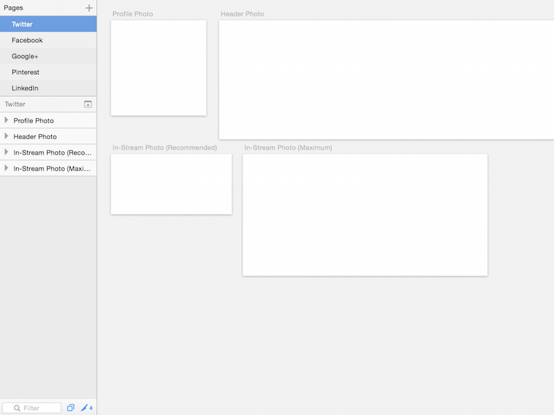

Social Media Graphic Templates for Sketch
=========================================

Artboards pre-sized as templates for various social media profiles and feed graphics, ready for use in Sketch for your graphic designing pleasure.

 

Currently contains pages for Twitter, Facebook, Google+, Pinterest, and LinkedIn. Pull requests for other sizes/ networks are welcome!

Dimensions are from [Sprout Social](http://sproutsocial.com/insights/social-media-image-sizes-guide/)

Created by [Zoe Rooney](http://zoerooney.com)

About Sketch
------------

[Sketch](http://bohemiancoding.com/sketch/) is a newish graphics editing app for Mac that is quickly growing in popularity as an alternative to Photoshop. 

Changelog
------------
1.0 Initial release

License
------------
[WTFPL](http://www.wtfpl.net/)